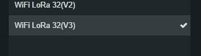

# LoRa Communication System

## Description
This project demonstrates a LoRa communication setup using Heltec WiFi LoRa 32 devices. It includes a sender and a receiver, facilitating bi-directional communication between the two. The system handles data transmission through LoRa, displays information on an OLED, and manages network connectivity and power states. But it's a single codebase, so it needs to be encapsulated into a class to handle initialization and all it's features.

## Features
- **LoRa Communication:** Utilizes the LoRa protocol..
- **OLED Display:** Output information and status on an OLED display (Packages received can be seen on it, although it's recommended when debugging to use the serial monitor)
- **Power Management:** Includes deep sleep mode for energy efficiency, it should be implementade later on in the class methods...
- **Interrupt Handling:** Manages device functionality based on external interrupts (Investigate this further).
- **CSV Data Parsing:** Parses and sends structured CSV data through LoRa (Initially it'll read from a csv inside the code, but the idea for the future should be to read from a file or any other method, the csv parser library also has some examples reading from files).

## Hardware Requirements
- 2 x Heltec WiFi LoRa 32 (V2)
- USB4 cables for programming 

## Software Dependencies
- Arduino IDE
- Heltec ESP32 Library
- `WiFi.h`
- `LoRaWan_APP.h`
- `Wire.h`
- `HT_SSD1306Wire.h`
- Custom `CSV_Parser.h` for handling CSV data inputs [HERE!](https://github.com/michalmonday/CSV-Parser-for-Arduino/tree/master)

## Setup and Configuration
1. **Hardware Setup:**
   - Connect each Heltec WiFi LoRa 32 to your computer via USB.
   - Antennaes are not necessary when debugging, embedded ones have a good range.

2. **Software Setup:**
   - Install the Arduino IDE from [Arduino's official website](https://www.arduino.cc/en/software).
   - Add the Heltec ESP32 board to your Arduino IDE:
     - Go to File > Preferences, enter the following URL in Additional Board Manager URLs:
       ```
       https://dl.espressif.com/dl/package_esp32_index.json
       ```
     - Open Tools > Board > Boards Manager, search for "ESP32" and install.
   - Install the required libraries (`WiFi`, `LoRaWan_APP`, `Wire`, `HT_SSD1306Wire`) using the Library Manager in the Arduino IDE.
   PD: I used [this](https://www.youtube.com/watch?v=shJxD5fiEhs) video, should be self-explanatory

## Usage
1. **Programming the Devices:**
   - Open the sender and receiver sketches in the Arduino IDE.
   ## :warning: Important!
** I PERSONALLY USED THE HELTEC WIFI LoRa 32(V3) **


   - Select the correct board from Tools () > Board and choose the correct port from Tools > Port.
   - Upload the sender code to one Heltec device and the receiver code to another.

2. **Operating the System:**
   - Power the devices. They should automatically start sending and receiving data.
   - Observe the transmitted and received data on the OLED displays.

## Troubleshooting
- **Connection Issues:** Ensure that both devices are within the range of LoRa signal and that antennas are properly attached (although it's not needed but.. don't debug one if the other one is in another room without antennas.......range with antennas is quuite good).
- **Display Issues:** Check the connections to the OLED display and ensure the `HT_SSD1306Wire` library is correctly installed.

